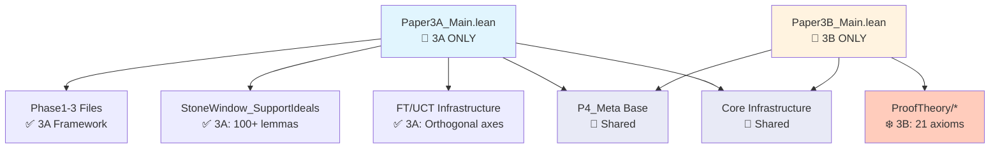

# Master Dependency Chart: Papers 3A & 3B Separation

**Last Updated**: September 2025 (Paper 3A Resumption)

## 🚨 THIS IS THE AUTHORITATIVE GUIDE FOR PAPER 3A/3B SEPARATION

**All developers MUST read this guide before working on Papers 3A or 3B.**

## 🎯 Executive Summary

This master chart clearly separates Paper 3A (Axiom Calibration Framework) from Paper 3B (Proof-Theoretic Scaffold), identifying:
- ✅ Which files belong to each paper
- 🔵 Shared infrastructure
- ❄️ Frozen components (Paper 3B - DO NOT MODIFY)
- 🟢 Active development areas (Paper 3A)

## 📦 Aggregator Files

### Main Entry Points
```
Paper3A_Main.lean  ← NEW: Paper 3A ONLY aggregator (to be created)
Paper3B_Main.lean  ← NEW: Paper 3B ONLY aggregator (to be created)
P3_Minimal.lean    ← LEGACY: Combined entry (deprecate after split)
```

## 🔷 Paper 3A Components (ACTIVE DEVELOPMENT)

### Core Framework
```
✅ Phase1_Simple.lean                 # Bicategorical foundation
✅ Phase2_UniformHeight.lean          # Height theory
✅ Phase2_API.lean                    # API bridges
✅ Phase2_Positive.lean               # Positive uniformization
✅ Phase2_PositiveTruthAlgebra.lean   # Truth algebra
✅ Phase2_PositivePins.lean           # Pins framework
✅ Phase3_Levels.lean                 # Numeric API
✅ Phase3_Positive.lean               # Positive bridges
✅ Phase3_StoneWindowMock.lean        # Mock examples
```

### Paper 3A Specific Meta Components
```
✅ P4_Meta/StoneWindow_SupportIdeals.lean  # 3400+ lines, 100+ lemmas
✅ P4_Meta/FT_UCT_MinimalSurface.lean      # FT axis infrastructure
✅ P4_Meta/FT_Frontier.lean                # FT→UCT, Sperner, BFPT
✅ P4_Meta/FTPortalWire.lean               # FT height transport
✅ P4_Meta/DCw_Frontier.lean               # DC_ω axis (future 3C)
✅ P4_Meta/DCwPortalWire.lean              # DC_ω transport
✅ P4_Meta/Frontier_API.lean               # Frontier infrastructure
```

### Paper 3A Tests
```
test/Stone_BA_Sanity.lean
test/Stone_D3c4_Sanity.lean
test/Stone_ISupportIdeal_Sanity.lean
test/Stone_LinfQuot_Sanity.lean
test/Stone_PhiIdem_Sanity.lean
test/Stone_PhiLift_Sanity.lean
test/Stone_PhiStoneIdem_Sanity.lean
test/Stone_SetQuot_Sanity.lean
test/FT_UCT_Sanity.lean
```

## 🔶 Paper 3B Components (FROZEN - COMPLETE)

### ProofTheory Directory (21 Axioms Achieved)
```
❄️ P4_Meta/ProofTheory/Core.lean         # Stage-based ladders
❄️ P4_Meta/ProofTheory/Reflection.lean   # RFN machinery
❄️ P4_Meta/ProofTheory/Heights.lean      # Height certificates
❄️ P4_Meta/ProofTheory/Progressions.lean # Progression theory
❄️ P4_Meta/ProofTheory/Collisions.lean   # 21 axioms, RFN→Con
```

### Paper 3B Tests
```
❄️ test/ProofTheory_Sanity.lean
❄️ test/Bot_is_FalseInN_test.lean
❄️ test/Sigma1Bot_test.lean
```

## 🔵 Shared Infrastructure (Used by Both)

### Core Infrastructure
```
Core/Prelude.lean               # Universe setup
Core/FoundationBasic.lean       # Foundation types
Core/Coherence.lean             # 2-cat coherence
Core/CoherenceTwoCellSimp.lean  # Simp lemmas
Core/UniverseLevels.lean        # Universe management
```

### P4_Meta Base (Parts III-VI)
```
# Meta Foundation
P4_Meta/Meta_Signature.lean     # Theory/Extend
P4_Meta/Meta_Witnesses.lean     # Witness tracking
P4_Meta/Meta_Ladders.lean       # ExtendIter
P4_Meta/Meta_UpperBounds.lean   # Upper bounds
P4_Meta/Meta_LowerBounds_Axioms.lean # Lower bounds

# Part III: Ladder Algebra
P4_Meta/PartIII_Certificates.lean  # HeightCertificate
P4_Meta/PartIII_Ladders.lean       # Ladder operations
P4_Meta/PartIII_ProductSup.lean    # Pair certificates
P4_Meta/PartIII_MultiSup.lean      # N-ary aggregator
P4_Meta/PartIII_ProductHeight.lean # fuseSteps
P4_Meta/PartIII_Schedule.lean      # k-ary scheduling
P4_Meta/PartIII_Concat.lean        # Two-phase composition
P4_Meta/PartIII_NormalForm.lean    # Canonical forms
P4_Meta/PartIII_PosFam.lean        # Positive families

# Part IV: Limits
P4_Meta/PartIV_Limit.lean          # ω-limit theory

# Part V: Collision Theory
P4_Meta/PartV_Interfaces.lean      # Complexity interfaces
P4_Meta/PartV_Reflection.lean      # Reflection principle
P4_Meta/PartV_Collision.lean       # RFN→Con→Gödel
P4_Meta/PartV_Strictness.lean      # Strictness results
P4_Meta/PartV_RFNSigma1.lean       # RFN_Σ₁ specifics

# Part VI: Calibrators
P4_Meta/PartVI_Calibrators.lean    # Paper3Theory
P4_Meta/PartVI_StoneCalibration.lean # Stone calibration
P4_Meta/PartVI_FT_to_UCT.lean      # FT→UCT reduction
P4_Meta/PartVI_FT_UCT_Cantor.lean  # Cantor examples
```

### Integration Layer
```
Paper3_Integration.lean         # Main integration
Phase3_Obstruction.lean         # Obstruction proof
P4_Meta/P3_P4_Bridge.lean      # Bridge layer
```

## 📊 Dependency Graph



## 🚦 Development Status

### Paper 3A Files (Active Development)
| Component | Status | Action |
|-----------|--------|--------|
| Phase 1-3 Framework | ✅ Complete | Polish docs |
| StoneWindow API | ✅ Complete | Final testing |
| FT/UCT Infrastructure | ✅ Complete | Verify orthogonality |
| Tests | 🟢 Active | Add coverage |
| Documentation | 🟢 Active | Complete docstrings |

### Paper 3B Files (Frozen)
| Component | Status | Action |
|-----------|--------|--------|
| ProofTheory/Core | ❄️ FROZEN | No changes |
| ProofTheory/Reflection | ❄️ FROZEN | No changes |
| ProofTheory/Heights | ❄️ FROZEN | No changes |
| ProofTheory/Progressions | ❄️ FROZEN | No changes |
| ProofTheory/Collisions | ❄️ FROZEN | No changes |

## 📝 Aggregator File Templates

### Paper3A_Main.lean (To Create)
```lean
/-
  Paper 3A: Axiom Calibration Framework
  Main aggregator for Paper 3A components ONLY
-/

-- Core framework
import Papers.P3_2CatFramework.Phase1_Simple
import Papers.P3_2CatFramework.Phase2_UniformHeight
import Papers.P3_2CatFramework.Phase2_API
import Papers.P3_2CatFramework.Phase2_Positive
import Papers.P3_2CatFramework.Phase3_Levels
import Papers.P3_2CatFramework.Phase3_Positive

-- Stone Window
import Papers.P3_2CatFramework.P4_Meta.StoneWindow_SupportIdeals

-- FT/UCT Axis
import Papers.P3_2CatFramework.P4_Meta.FT_UCT_MinimalSurface
import Papers.P3_2CatFramework.P4_Meta.FT_Frontier

-- Shared meta (needed for height calculus)
import Papers.P3_2CatFramework.P4_Meta.PartIII_Certificates
import Papers.P3_2CatFramework.P4_Meta.PartIII_Ladders

-- DO NOT import ProofTheory/* (Paper 3B)
```

### Paper3B_Main.lean (To Create)
```lean
/-
  Paper 3B: Proof-Theoretic Scaffold
  Main aggregator for Paper 3B components ONLY
  STATUS: FROZEN - Complete with 21 axioms
-/

-- ProofTheory components
import Papers.P3_2CatFramework.P4_Meta.ProofTheory.Core
import Papers.P3_2CatFramework.P4_Meta.ProofTheory.Reflection
import Papers.P3_2CatFramework.P4_Meta.ProofTheory.Heights
import Papers.P3_2CatFramework.P4_Meta.ProofTheory.Progressions
import Papers.P3_2CatFramework.P4_Meta.ProofTheory.Collisions

-- Shared meta (needed for ladder algebra)
import Papers.P3_2CatFramework.P4_Meta.PartIII_Certificates
import Papers.P3_2CatFramework.P4_Meta.PartV_Collision

-- DO NOT import Stone Window or FT/UCT (Paper 3A)
```

## ⚠️ Critical Rules for Paper 3A Development

1. **DO NOT MODIFY** any file in `P4_Meta/ProofTheory/` - these are Paper 3B frozen
2. **DO NOT IMPORT** ProofTheory files in Paper 3A code
3. **USE Paper3A_Main.lean** as the entry point for Paper 3A work
4. **SHARED FILES** (P4_Meta base) can be used but should be modified carefully
5. **TEST ISOLATION**: Paper 3A tests should not depend on Paper 3B components

## 📋 Migration Checklist

### ✅ Completed (September 2025)
- [x] Create `Paper3A_Main.lean` aggregator ✅
- [x] Create `Paper3B_Main.lean` aggregator ✅
- [x] Create `Paper3_Transition.lean` for smooth migration ✅
- [x] Update CI to build both aggregators separately (`paper3-separated-ci.yml`) ✅
- [x] Verify no cross-dependencies between 3A and 3B specific files ✅
  - Paper3A doesn't import ProofTheory ✓
  - Paper3B doesn't import Stone/FT ✓
- [x] Update documentation to reference new aggregators ✅
  - All READMEs updated with separation guide
  - Master dependency chart prominently linked

### ✅ Just Completed (September 2025 - Final Steps)
- [x] Deprecate `P3_Minimal.lean` ✅ (Added deprecation notice)
- [x] Update `P3_AllProofs.lean` to use new aggregators ✅ (Now uses Paper3_Transition)
- [x] Remove references to old P3_Minimal in codebase ✅ (Documentation updated)

### 🎉 Migration Complete!
All migration steps have been completed. The separation is now fully functional.

## 🎯 Summary

**Paper 3A (Active)**: AxCal framework, WLPO/FT axes, Stone Window API
**Paper 3B (Frozen)**: ProofTheory with 21 axioms, RFN→Con theorems
**Shared**: Core infrastructure, P4_Meta base (Parts III-VI)
**Separation**: Clean aggregator files ensure no accidental cross-contamination