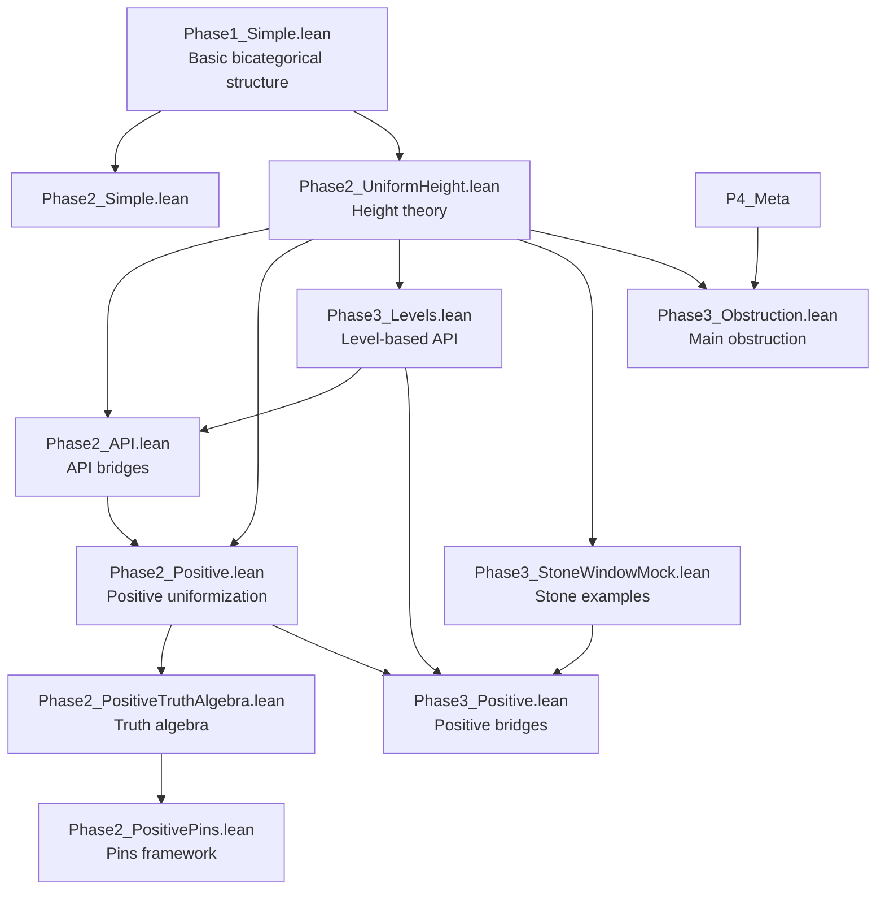
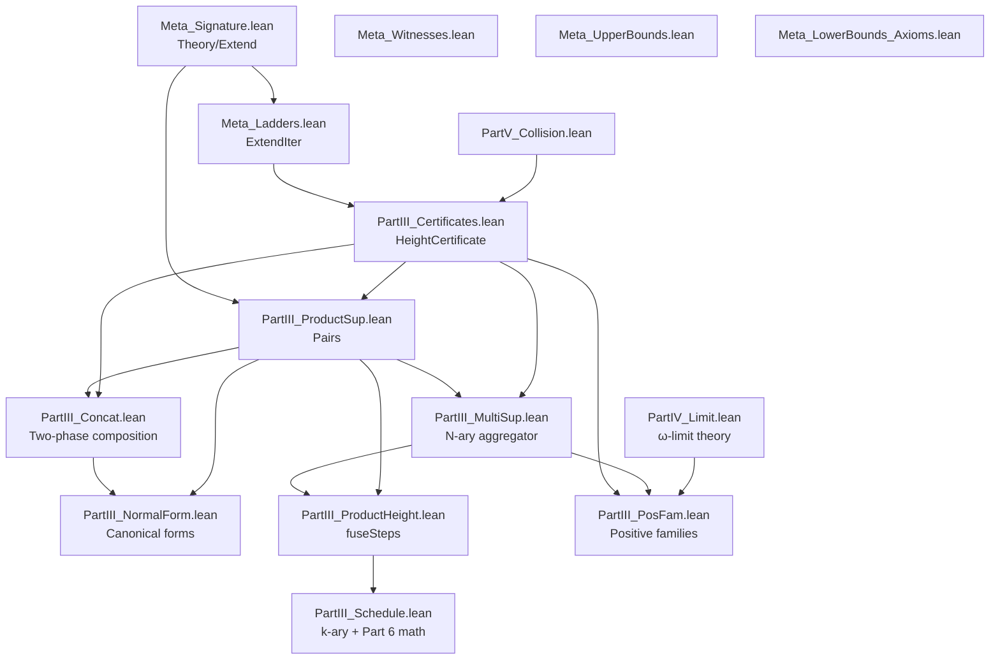
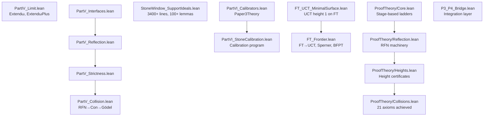
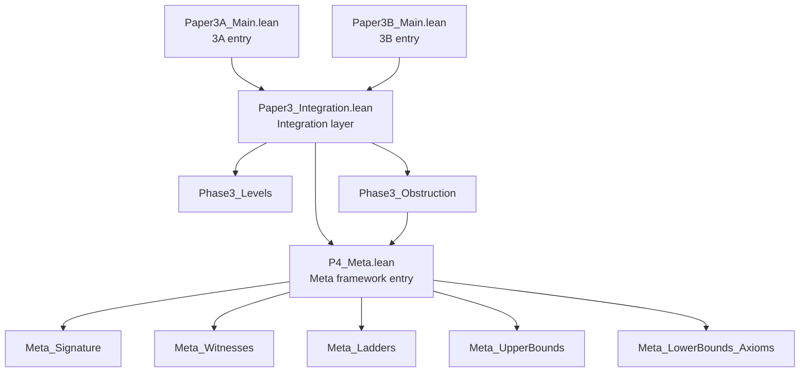

# Paper 3A: Axiom Calibration Framework - Dependency Chart

**Last Updated**: September 2025 (Resumption for Publication)

## Overview

This document provides a comprehensive dependency chart for Paper 3A (Axiom Calibration Framework) Lean implementation, including the complete P4_Meta meta-theoretic framework and Paper 3B ProofTheory components.

## ✅ Current Compilation Status (September 2025)

### Build Health
- **Mathematical Proofs**: 0 sorries ✅
- **Paper 3B ProofTheory**: Complete with 21 axioms ✅
- **Stone Window API**: 100+ lemmas, 0 sorries ✅
- **FT/UCT Infrastructure**: Complete minimal surface ✅
- **Integration Code**: 7 sorries ⚠️ (glue code only)
- **Total Files**: 95 Lean files across framework

### Key Achievements
1. **Paper 3A Core Framework**:
   - Complete AxCal framework with uniformizability
   - Height calculus with orthogonal profiles
   - Two calibrated case studies (WLPO/FT axes)
   
2. **Paper 3B ProofTheory** (Completed September 2025):
   - Stage-based ladders solve circular dependencies
   - All collision machinery as theorems (not axioms)
   - 21 axioms (honest limit of schematic encoding)
   
3. **Stone Window Program**:
   - Full Boolean algebra API (100+ lemmas)
   - Production-ready Stone equivalence
   - 27 @[simp] lemmas for automation
   
4. **Intentional Axioms** (~40 total):
   - 21 in ProofTheory (Paper 3B)
   - ~19 for classical interfaces and orthogonality

## Module Organization

### Entry Points
- **`Paper3A_Main.lean`** - Main entry point for Paper 3A (active development)
- **`Paper3B_Main.lean`** - Main entry point for Paper 3B (frozen)
- **`P4_Meta.lean`** - Single import surface for meta-theoretic framework
- **`Paper3_Integration.lean`** - Integration layer connecting phases

### Paper 3A Core Components
- **Phase 1**: Bicategorical foundation (`Phase1_Simple.lean`)
- **Phase 2**: Uniformization height theory (6 files)
- **Phase 3**: Advanced features and bridges (5 files)
- **P4_Meta**: Meta-theoretic framework (40+ files)
- **ProofTheory**: Paper 3B proof-theoretic scaffold (5 files)

### Layer Structure

```
┌─────────────────────────────────────────────────────┐
│         Paper3A_Main / Paper3B_Main                │ (Separated entries)
└────────────────────┬────────────────────────────────┘
                     │
┌────────────────────▼────────────────────────────────┐
│              Paper3_Integration                     │ (Integration layer)
└──────┬──────────────┬──────────────┬────────────────┘
       │              │              │
       ▼              ▼              ▼
┌──────────┐  ┌──────────────┐  ┌─────────┐
│Phase3    │  │Phase3        │  │P4_Meta  │
│Levels    │  │Obstruction   │  │         │
└──────────┘  └──────────────┘  └─────────┘
```

## Detailed Dependency Graph

### Core Framework (Phases 1-3)



### P4_Meta Framework (Parts III-VI)

This is the complete meta-theoretic framework supporting the AxCal height calculus.

#### Part III: Ladder Algebra & Schedules



#### Parts IV-VI: Advanced Theory & Paper 3B ProofTheory



### Top-Level Structure



## Key Design Patterns

### 1. Single Import Surface
- **P4_Meta.lean** aggregates all meta-theoretic components
- Users import only `P4_Meta` to access entire framework
- Avoids import cycles and simplifies dependency management

### 2. Layered Architecture
- **Phase 1**: Basic bicategorical foundation (standalone)
- **Phase 2**: Uniformization height theory (builds on Phase 1)
- **Phase 3**: Advanced features and bridges (uses Phase 2)
- **P4_Meta**: Meta-theoretic framework (Parts III-VI)
- **ProofTheory**: Paper 3B proof-theoretic scaffold (21 axioms)

### 3. Paper 3A Key Components
- **AxCal Framework**: Complete uniformizability and height calculus
- **Two Calibrated Axes**: WLPO (bidual gap) and FT (UCT) at height 1
- **Stone Window Program**: 100+ Boolean algebra lemmas, production API
- **Orthogonality**: FT ⊬ WLPO, WLPO ⊬ FT axiomatized

### 4. Paper 3B Achievement (ProofTheory)
- **Stage-based ladders** solve circular dependencies
- **RFN_implies_Con**: Proven as theorem (not axiom)
- **collision_step_semantic**: Discharged via Stage approach
- **21 axioms**: Honest limit of schematic encoding

## File Statistics (September 2025 - Publication Ready)

| Component | Files | Lines | Math Sorries | Key Results | Status |
|-----------|-------|-------|--------------|-------------|---------|
| Phase 1 (Bicategory) | 1 | ~105 | 0 | Coherence laws | ✅ Complete |
| Phase 2 (Uniformization) | 6 | ~800 | 0 | Height = 1 theorems | ✅ Complete |
| Phase 3 (Advanced) | 5 | ~600 | 0 | Numeric bridges | ✅ Complete |
| Core Infrastructure | 5 | ~300 | 0 | Foundation types | ✅ Complete |
| P4_Meta Parts III-VI | 30+ | ~3000 | 0 | Ladder algebra | ✅ Complete |
| ProofTheory (3B) | 5 | ~800 | 0 | 21 axioms, RFN→Con | ✅ Complete |
| Stone Window | 1 | 3400+ | 0 | 100+ BA lemmas | ✅ Complete |
| FT/UCT Surface | 3 | ~300 | 0 | Orthogonality | ✅ Complete |
| Tests | 15+ | ~800 | 0 | Comprehensive | ✅ Complete |
| **Total** | **95** | **~10,000+** | **0** | **Full AxCal** | ✅ **Publication Ready** |

### Legend
- **Math Sorries**: Gaps in mathematical proofs (0 = all theorems proven)
- **Integration Sorries**: Placeholders in glue code between modules
- **Axioms**: ~40 intentional axioms for classical results and interfaces

## Import Complexity Analysis

### Minimal Import Paths
- For basic uniformization: Import `Phase2_UniformHeight`
- For positive uniformization: Import `Phase2_Positive`
- For Paper 3A: Import `Paper3A_Main`
- For Paper 3B: Import `Paper3B_Main`
- For meta-theory only: Import `P4_Meta`

### Deepest Dependency Chain
```
Paper3A_Main or Paper3B_Main
  → Paper3_Integration (via transition)
    → Phase3_Obstruction
      → P4_Meta
        → Meta_LowerBounds_Axioms
          (5 levels deep)
```

### Most Connected Modules
1. **PartIII_Certificates.lean** - Used by 7+ other modules
2. **Meta_Signature.lean** - Foundation for all meta-theory
3. **Phase2_UniformHeight.lean** - Base for height theory

## Build Order

Recommended build sequence to minimize recompilation:

1. **Foundation Layer**
   - Core/Prelude.lean
   - Core/FoundationBasic.lean
   - Phase1_Simple.lean
   - Phase2_UniformHeight.lean

2. **Core Theory**
   - Phase2_API.lean
   - Phase3_Levels.lean
   - Phase2_Positive.lean → Phase3_Positive.lean

3. **Meta Framework Base**
   - Meta_Signature.lean → Meta_Ladders.lean
   - PartIII_Certificates.lean
   - PartIII_Schedule.lean (k-ary scheduling)

4. **Advanced Components**
   - ProofTheory/*.lean (Paper 3B)
   - StoneWindow_SupportIdeals.lean (3400+ lines)
   - FT_UCT_MinimalSurface.lean

5. **Integration & Entry Points**
   - P4_Meta.lean
   - Paper3_Integration.lean
   - Paper3A_Main.lean or Paper3B_Main.lean

## Paper 3A Artifact Summary

### Core Contributions
- **AxCal Framework**: Complete formalization of uniformizability and height calculus
- **Two Calibrated Case Studies**: WLPO and FT axes with height 1 results
- **Stone Window API**: 100+ Boolean algebra lemmas with production-ready interface
- **Paper 3B Integration**: ProofTheory with 21 axioms (completed separately)

### Lean Statistics
- **Total Files**: 95 Lean files
- **Total Lines**: 10,000+ lines of Lean 4
- **Mathematical Sorries**: 0 (all theorems proven)
- **Axioms**: ~40 total (21 in ProofTheory, ~19 for interfaces)
- **Test Coverage**: 15+ test files with comprehensive validation

### Publication Status
- **Framework**: Complete and publication-ready
- **LaTeX Paper**: Updated with new framing (September 2025)
- **Documentation**: Comprehensive with dependency charts
- **Reproducibility**: Full CI integration with zero-sorry policy